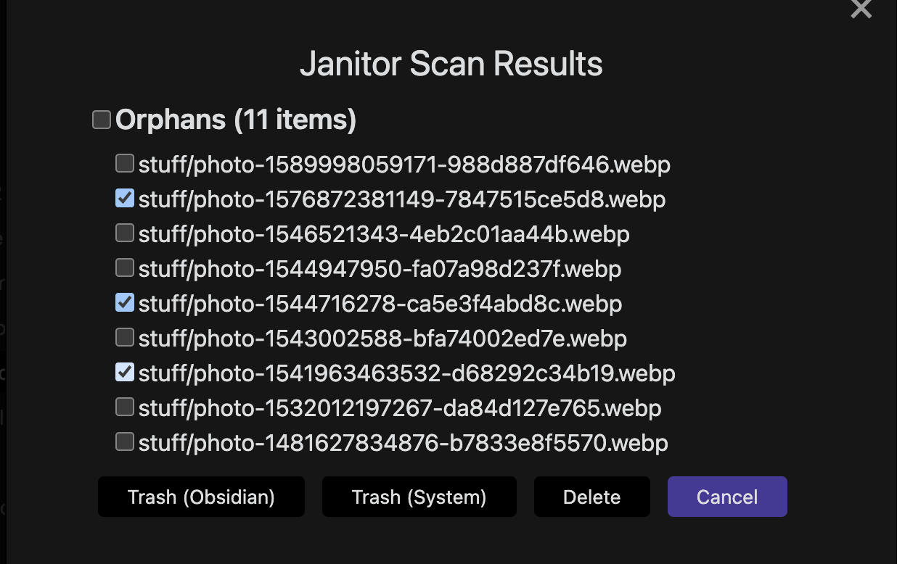

# Cleaning service plugin

This plugin helps keeping the vault under control, by possibily removing the following resources.

## Orphan files

These are media or attachments that are not referenced anywhere. Cleaning service looks also in frontmatters (for example for `annotation-target` or similar)

## Empty files

These are files either empty or consisting only of whitespace (newlines, tabs, and so on)

## Empty directories

Cleaning service can identify and remove empty directories from your vault. A directory is considered empty if it contains no files and only contains other empty directories (or no subdirectories at all). This helps keep your vault structure clean by removing unnecessary empty directories.

## Big files

You can specify a limit size and Cleaning service will prompt you delete big files. Use it at your own risk. By default Cleaning service will prompt if about to delete a big file, even if the "ask confirmation" setting is disable.

## Expired notes

Cleaning service uses an approach similar to [Obsidian Expiring Notes](https://github.com/joerncodes/obsidian-expiring-notes) in which a (configurable) attribute is looked for in the frontmatter in order to set an expiration date to notes. For Example:

```
---
expires: 2022-09-01
---
```

Cleaning service also comes with utilities command used to easily set expiration date into notes.

## Excluded files

Cleaning service can exclude files that are excluded by Obsidian (Settings->Files & Linkds->Excluded files) but users can also specify different criterias for exclusions (for example based on file extension or path).

## How to run

Cleaning service could be set to run at startup. If "ask confirmation" is set, it will prompt the user with a confirmation dialog. User can select which files to delete and which action to perform (trash in Obsidian, trash in OS or delete permanently).

Cleaning service scan can also be launched from a ribbon button or from commands.



## Copyrights

This plugin is fork [obsidian-janitor](https://github.com/canna71/obsidian-janitor) plugin.

## History

First version of app was writen "Tue Jul 15 17:44:37 2025 +0300".
